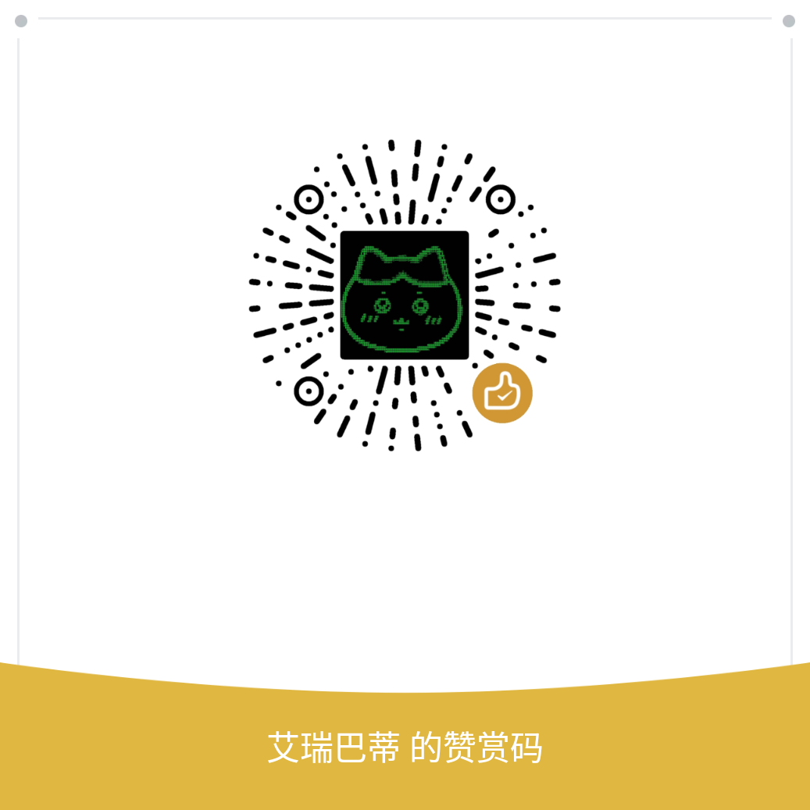

<div align="center">

  <h1>Codex Proxy</h1>
  <h3>Your Local Codex Coding Assistant Gateway</h3>
  <p>Expose Codex Desktop's capabilities as standard OpenAI / Anthropic / Gemini APIs, seamlessly connecting any AI client.</p>

  <p>
    
    
    
    
    
    
  </p>

  <p>
    <a href="#-quick-start">Quick Start</a> &bull;
    <a href="#-features">Features</a> &bull;
    <a href="#-available-models">Models</a> &bull;
    <a href="#-client-setup">Client Setup</a> &bull;
    <a href="#-configuration">Configuration</a>
  </p>

  <p>
    <a href="./README.md">简体中文</a> |
    <strong>English</strong>
  </p>

  <br>

  <a href="https://x.com/IceBearMiner"></a>
  <a href="https://github.com/icebear0828/codex-proxy/issues"></a>
  <a href="#-donate"></a>

</div>

---

**Codex Proxy** is a lightweight local gateway that translates the [Codex Desktop](https://openai.com/codex) Responses API into multiple standard protocol endpoints — OpenAI `/v1/chat/completions`, Anthropic `/v1/messages`, Gemini, and Codex `/v1/responses` passthrough. Use Codex coding models directly in Cursor, Claude Code, Continue, or any compatible client.

Just a ChatGPT account (or a third-party API relay) and this proxy — your own personal AI coding assistant gateway, running locally.

## 🚀 Quick Start

### Desktop App (Easiest)

Download the installer from [GitHub Releases](https://github.com/icebear0828/codex-proxy/releases):

| Platform | Installer |
|----------|-----------|
| Windows | `Codex Proxy Setup x.x.x.exe` |
| macOS | `Codex Proxy-x.x.x.dmg` |
| Linux | `Codex Proxy-x.x.x.AppImage` |

Open the app, log in with your ChatGPT account. Dashboard at `http://localhost:8080`.

### Docker

```bash
mkdir codex-proxy && cd codex-proxy
curl -O https://raw.githubusercontent.com/icebear0828/codex-proxy/master/docker-compose.yml
curl -O https://raw.githubusercontent.com/icebear0828/codex-proxy/master/.env.example
cp .env.example .env
docker compose up -d
# Open http://localhost:8080 to log in
```

> Data persists in `data/`. Cross-container access: use host LAN IP (e.g. `192.168.x.x:8080`), not `localhost`. Uncomment Watchtower in `docker-compose.yml` for auto-updates.

### From Source

```bash
git clone https://github.com/icebear0828/codex-proxy.git
cd codex-proxy
npm install                        # Backend deps + auto-download curl-impersonate
cd web && npm install && cd ..     # Frontend deps
npm run dev                        # Dev mode (hot reload)
# Or: npm run build && npm start   # Production mode
```

> On Windows, curl-impersonate is not available. Falls back to system curl.

### Verify

```bash
curl http://localhost:8080/v1/chat/completions \
  -H "Content-Type: application/json" \
  -d '{"model":"codex","messages":[{"role":"user","content":"Hello!"}],"stream":true}'
```

## 🌟 Features

### 1. 🔌 Full Protocol Compatibility
- Compatible with `/v1/chat/completions` (OpenAI), `/v1/messages` (Anthropic), Gemini, and `/v1/responses` (Codex passthrough)
- SSE streaming, works with all OpenAI / Anthropic SDKs and clients
- Automatic bidirectional translation between all protocols and Codex Responses API
- **Structured Outputs** — `response_format` (`json_object` / `json_schema`) and Gemini `responseMimeType`
- **Function Calling** — native `function_call` / `tool_calls` across all protocols

### 2. 🔐 Account Management & Smart Rotation
- **OAuth PKCE login** — one-click browser auth
- **Multi-account rotation** — `least_used`, `round_robin`, and `sticky` strategies
- **Plan Routing** — accounts on different plans (free/plus/team/business) auto-route to their supported models
- **Auto token refresh** — JWT renewed before expiry with exponential backoff
- **Quota auto-refresh** — background polling every 5 min; configurable warning thresholds; exhausted accounts auto-skip
- **Ban detection** — upstream 403 auto-marks banned; 401 token invalidation auto-expires and switches account
- **Relay accounts** — connect third-party API relays (API Key + baseUrl) with auto format detection
- **Web dashboard** — account management, usage stats, batch operations; dashboard login gate for remote access

### 3. 🌐 Proxy Pool
- **Per-account proxy routing** — different upstream proxies per account
- **Four assignment modes** — Global Default / Direct / Auto / Specific proxy
- **Health checks** — scheduled + manual, reports exit IP and latency
- **Auto-mark unreachable** — unreachable proxies excluded from rotation

### 4. 🛡️ Anti-Detection & Protocol Impersonation
- **Chrome TLS fingerprint** — curl-impersonate replicates the full Chrome TLS handshake
- **Desktop header replication** — `originator`, `User-Agent`, `sec-ch-*` headers in exact Codex Desktop order
- **Desktop context injection** — optional system prompt injection (off by default, enable via `model.inject_desktop_context`)
- **Cookie persistence** — automatic Cloudflare cookie capture and replay
- **Fingerprint auto-update** — polls Codex Desktop update feed, auto-syncs `app_version` and `build_number`

## 🏗️ Architecture

```
                                Codex Proxy
┌──────────────────────────────────────────────────────────┐
│                                                          │
│  Client (Cursor / Claude Code / Continue / SDK / ...)    │
│       │                                                  │
│  POST /v1/chat/completions (OpenAI)                      │
│  POST /v1/messages         (Anthropic)                   │
│  POST /v1/responses        (Codex passthrough)           │
│  POST /gemini/*            (Gemini)                      │
│       │                                                  │
│       ▼                                                  │
│  ┌──────────┐    ┌───────────────┐    ┌──────────────┐   │
│  │  Routes   │──▶│  Translation  │──▶│    Proxy     │   │
│  │  (Hono)  │   │ Multi→Codex   │   │ curl TLS/FFI │   │
│  └──────────┘   └───────────────┘   └──────┬───────┘   │
│       ▲                                     │           │
│       │          ┌───────────────┐          │           │
│       └──────────│  Translation  │◀─────────┘           │
│                  │ Codex→Multi   │  SSE stream          │
│                  └───────────────┘                       │
│                                                          │
│  ┌──────────┐  ┌───────────────┐  ┌──────────────────┐  │
│  │   Auth   │  │  Fingerprint  │  │   Model Store    │  │
│  │ OAuth/JWT│  │Chrome TLS/UA  │  │ Static + Dynamic │  │
│  │  Relay   │  │   Cookie      │  │  Plan Routing    │  │
│  └──────────┘  └───────────────┘  └──────────────────┘  │
│                                                          │
└──────────────────────────────────────────────────────────┘
                          │
                  curl-impersonate / FFI
                   (Chrome TLS fingerprint)
                          │
                   ┌──────┴──────┐
                   ▼             ▼
              chatgpt.com   Relay providers
         /backend-api/codex  (3rd-party API)
```

## 📦 Available Models

| Model ID | Alias | Reasoning Efforts | Description |
|----------|-------|-------------------|-------------|
| `gpt-5.4` | — | low / medium / high / xhigh | Latest flagship model |
| `gpt-5.4-mini` | — | low / medium / high / xhigh | 5.4 lightweight version |
| `gpt-5.3-codex` | — | low / medium / high / xhigh | 5.3 coding-optimized model |
| `gpt-5.2-codex` | `codex` | low / medium / high / xhigh | Frontier agentic coding model (default) |
| `gpt-5.2` | — | low / medium / high / xhigh | Professional work & long-running agents |
| `gpt-5.1-codex-max` | — | low / medium / high / xhigh | Extended context / deepest reasoning |
| `gpt-5.1-codex` | — | low / medium / high | GPT-5.1 coding model |
| `gpt-5.1` | — | low / medium / high | General-purpose GPT-5.1 |
| `gpt-5-codex` | — | low / medium / high | GPT-5 coding model |
| `gpt-5` | — | minimal / low / medium / high | General-purpose GPT-5 |
| `gpt-oss-120b` | — | low / medium / high | Open-source 120B model |
| `gpt-oss-20b` | — | low / medium / high | Open-source 20B model |
| `gpt-5.1-codex-mini` | — | medium / high | Lightweight, fast coding model |
| `gpt-5-codex-mini` | — | medium / high | Lightweight coding model |

> **Suffixes**: Append `-fast` for Fast mode, `-high`/`-low` for reasoning effort. E.g. `codex-fast`, `gpt-5.2-codex-high-fast`.
>
> **Plan Routing**: Accounts on different plans auto-route to their supported models. Models are dynamically fetched and auto-synced.

## 🔗 Client Setup

> Get your API Key from the dashboard (`http://localhost:8080`). Use `codex` (default gpt-5.2-codex) or any [model ID](#-available-models) as the model name.

### Claude Code (CLI)

```bash
export ANTHROPIC_BASE_URL=http://localhost:8080
export ANTHROPIC_API_KEY=your-api-key
# Switch model: export ANTHROPIC_MODEL=codex-fast / gpt-5.4 / gpt-5.1-codex-mini ...
claude
```

> Copy env vars from the **Anthropic SDK Setup** card in the dashboard.

### Claude for VSCode / JetBrains

Open Claude extension settings → **API Configuration**:
- **API Provider**: Anthropic
- **Base URL**: `http://localhost:8080`
- **API Key**: your API key

### Cursor

1. Settings → Models → OpenAI API
2. **Base URL**: `http://localhost:8080/v1`
3. **API Key**: your API key
4. Add model `codex`

### Windsurf

1. Settings → AI Provider → **OpenAI Compatible**
2. **API Base URL**: `http://localhost:8080/v1`
3. **API Key**: your API key
4. **Model**: `codex`

### Cline (VSCode Extension)

1. Cline sidebar → gear icon
2. **API Provider**: OpenAI Compatible
3. **Base URL**: `http://localhost:8080/v1`
4. **API Key**: your API key
5. **Model ID**: `codex`

### Continue (VSCode Extension)

`~/.continue/config.json`:
```json
{
  "models": [{
    "title": "Codex",
    "provider": "openai",
    "model": "codex",
    "apiBase": "http://localhost:8080/v1",
    "apiKey": "your-api-key"
  }]
}
```

### aider

```bash
aider --openai-api-base http://localhost:8080/v1 \
      --openai-api-key your-api-key \
      --model openai/codex
```

### Cherry Studio

1. Settings → Model Services → Add
2. **Type**: OpenAI
3. **API URL**: `http://localhost:8080/v1`
4. **API Key**: your API key
5. Add model `codex`

### Any OpenAI-Compatible Client

| Setting | Value |
|---------|-------|
| Base URL | `http://localhost:8080/v1` |
| API Key | from dashboard |
| Model | `codex` (or any model ID) |

<details>
<summary>SDK examples (Python / Node.js)</summary>

**Python**
```python
from openai import OpenAI
client = OpenAI(base_url="http://localhost:8080/v1", api_key="your-api-key")
for chunk in client.chat.completions.create(
    model="codex", messages=[{"role": "user", "content": "Hello!"}], stream=True
):
    print(chunk.choices[0].delta.content or "", end="")
```

**Node.js**
```typescript
import OpenAI from "openai";
const client = new OpenAI({ baseURL: "http://localhost:8080/v1", apiKey: "your-api-key" });
const stream = await client.chat.completions.create({
  model: "codex", messages: [{ role: "user", content: "Hello!" }], stream: true,
});
for await (const chunk of stream) {
  process.stdout.write(chunk.choices[0]?.delta?.content || "");
}
```

</details>

## ⚙️ Configuration

All configuration in `config/default.yaml`:

| Section | Key Settings | Description |
|---------|-------------|-------------|
| `server` | `host`, `port`, `proxy_api_key` | Listen address and API key |
| `api` | `base_url`, `timeout_seconds` | Upstream API URL and timeout |
| `client` | `app_version`, `build_number`, `chromium_version` | Codex Desktop version to impersonate |
| `model` | `default`, `default_reasoning_effort`, `inject_desktop_context` | Default model and reasoning config |
| `auth` | `rotation_strategy`, `rate_limit_backoff_seconds` | Rotation strategy and rate limit backoff |
| `tls` | `curl_binary`, `impersonate_profile`, `proxy_url`, `force_http11` | TLS impersonation and proxy |
| `quota` | `refresh_interval_minutes`, `warning_thresholds`, `skip_exhausted` | Quota refresh and warnings |
| `session` | `ttl_minutes`, `cleanup_interval_minutes` | Dashboard session management |

### Environment Variable Overrides

| Variable | Overrides |
|----------|-----------|
| `PORT` | `server.port` |
| `CODEX_PLATFORM` | `client.platform` |
| `CODEX_ARCH` | `client.arch` |
| `HTTPS_PROXY` | `tls.proxy_url` |

## 📡 API Endpoints

<details>
<summary>Click to expand full endpoint list</summary>

**Protocol Endpoints**

| Endpoint | Method | Description |
|----------|--------|-------------|
| `/v1/chat/completions` | POST | OpenAI format chat completions |
| `/v1/responses` | POST | Codex Responses API passthrough |
| `/v1/messages` | POST | Anthropic format chat completions |
| `/v1/models` | GET | List available models |

**Auth & Accounts**

| Endpoint | Method | Description |
|----------|--------|-------------|
| `/auth/login` | GET | OAuth login entry |
| `/auth/accounts` | GET | Account list (`?quota=true` / `?quota=fresh`) |
| `/auth/accounts/relay` | POST | Add relay account |
| `/auth/accounts/batch-delete` | POST | Batch delete accounts |
| `/auth/accounts/batch-status` | POST | Batch update account status |

**Admin**

| Endpoint | Method | Description |
|----------|--------|-------------|
| `/admin/rotation-settings` | GET/POST | Rotation strategy config |
| `/admin/quota-settings` | GET/POST | Quota refresh & warning config |
| `/admin/refresh-models` | POST | Trigger manual model list refresh |
| `/admin/usage-stats/summary` | GET | Usage stats summary |
| `/admin/usage-stats/history` | GET | Usage time series |
| `/health` | GET | Health check |

**Proxy Pool**

| Endpoint | Method | Description |
|----------|--------|-------------|
| `/api/proxies` | GET/POST | List / add proxies |
| `/api/proxies/:id` | PUT/DELETE | Update / remove proxy |
| `/api/proxies/:id/check` | POST | Health check single proxy |
| `/api/proxies/check-all` | POST | Health check all proxies |
| `/api/proxies/assign` | POST | Assign proxy to account |

</details>

## 📋 Requirements

- **Node.js** 18+ (20+ recommended)
- **curl** — system curl works; `npm install` auto-downloads curl-impersonate
- **ChatGPT account** — free account is sufficient
- **Docker** (optional)

## ⚠️ Notes

- Codex API is **stream-only**. `stream: false` causes the proxy to stream internally and return assembled JSON.
- This project relies on Codex Desktop's public API. Upstream updates are auto-detected and fingerprints auto-synced.
- On Windows, curl-impersonate is unavailable. Falls back to system curl — use Docker or WSL for full TLS impersonation.

## ☕ Donate

<div align="center">
  <p>Find this useful? Buy me a coffee!</p>
  
</div>

## 📄 License

**Non-Commercial** license:

- **Allowed**: Personal learning, research, self-hosted deployment
- **Prohibited**: Any commercial use including selling, reselling, paid proxy services, or commercial product integration

Not affiliated with OpenAI. Users assume all risks and must comply with OpenAI's Terms of Service.

---

<div align="center">
  <sub>Built with Hono + TypeScript | Powered by Codex Desktop API</sub>
</div>
